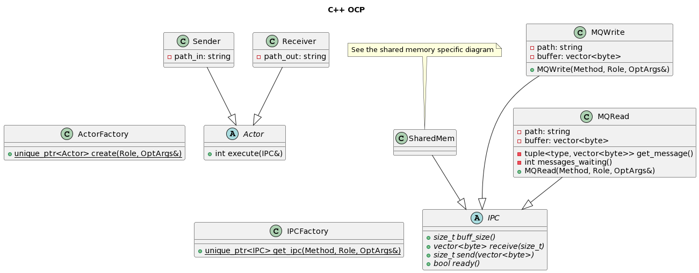
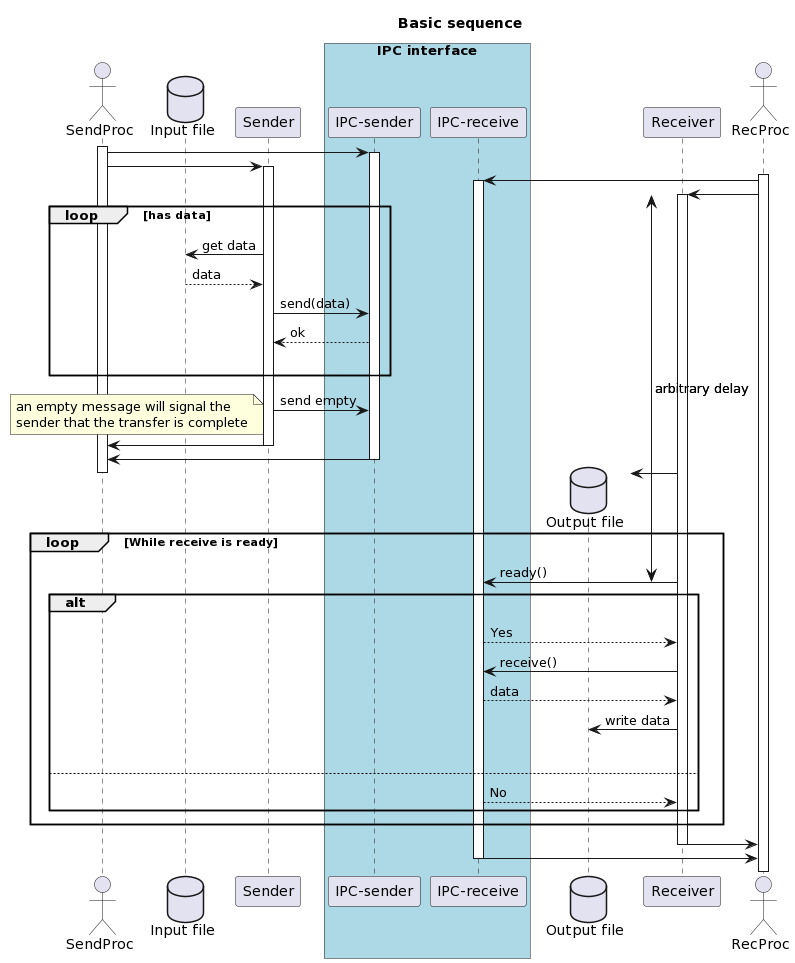

# Architecture overview

I have split the project in two parts, each encapsulating part of the behaviour of the application.

The `Actor` objects will link the IPC endpoint to the filesystem object, meaning that the Sender will
take an existing file and pipe it through the IPC object it receives while the Receiver will receive
data from the IPC object (through a polling system) and output it to a file

The `IPC` objects on the other hand will connect to each other through the Operating system API and
will expose a standardised interface.

These IPC objects will also encapsulate the resources they use (such as lock files, shared memory
objects etc) according to the RAII paradigm to ensure resources are properly disposed of

The normal operation is explained through the following sequence diagram:

Further details can be found in the:
+ [Queue description](queues.md)
+ [Shared memory description](sharedmem.md)