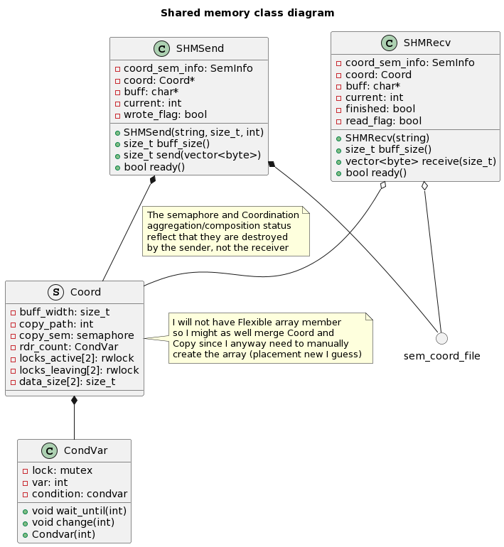

# Shared memory IPC
[Back to general](architecture.md)



Shared Memory IPC is a lower level type of interprocess communication which allows direct memory
access between multiple processes, this allows arbitrary communication schemes without constraints on
the direction of the information flow nor on the number of participants. The downside to this is that
great care must be take to prevent data races and memory corruption

In this specific case we want to allow one writer (the sender process) and multiple readers (the 
receiving processes) (the exact number is indicated to the writer when it is launched), the 
constraints this poses are the following:

1. Only the writer should be allowed to initialize the shared memory (since it is the only
    process which knows the size of the chunks)
2. Readers shouldn't attempt to read into the shared memory until this is set up by the writer
3. Only the expected number of readers should read the data being transferred
4. The writer should not start writing until all readers joined
5. The writer should clean up the memory after all readers left
6. Readers should not read data that the writer hasn't written yet
7. The writer should not overwrite data that the readers haven't read yet
8. Readers should not access data being written by the writer (and viceversa)

To achieve these objectives we'll use the following tools:
+ Read-write locks
+ Semaphores (named and not) 
+ Condition variables

## Read write locks
Read-write locks allow a more fine-grained control over concurrent memory access than mutexes, they 
rely on the fact that concurrent reads of shared memory are not an issue, whereas a process writing to
a shared memory location needs to be the only one writing or reading to that area.

A read-write lock has three states:
+ Free state, which allows both read-locking and write-locking
+ Read lock, which allows other read-locks to be aquired but not write-locks 
+ Write lock, which doesn't allow any other lock to be aquired

We use read-write locks to guard the buffers and the variables containing the size of data in the
chunk to satisfy requirements 6, 7 and 8

## Semaphores
Semaphore come in two forms, named semaphores are created as files in the operating system and can be 
easily accessed by multiple processes, while *normal* semaphores are (like mutexes) created in memory.

A semaphore allows up to a certain (variable) number of processes to access a shared resource (or to
enter into a critical section of code).

A semaphore supports two operations, `post` which lets one more process access the resource and `wait`
which blocks until the semaphore counter can be decreased and decreases it before waking up the 
process

We use both kinds of semaphores to achieve different objectives. Named semaphores allow reader 
processes to efficiently wait for the shared memory file to be created by the writer (the readers
will wait on an empty semaphore and, once it is unlocked by the writer each reader will post to it as
soon as it wakes up from the wait, ensuring all readers can access the shared memory)

We then use a memory based semaphore to ensure that only the desired number of readers is allowed
access to the copy process. This semaphore resides in the shared memory segment and is initialised by
the writer to the desired number of readers.

After the readers cleared the first semaphore and accessed the shared memory segment they will try to
lock the second semaphore (the try operation immediately fails if the semaphore is "empty"). If the
`trywait` operation succeeds then the reader will proceed to the transfer, if not it means that more 
readers than desired were started and the reader process will fail

## Condition variables
Finally condition variables allow one or more processes to wait for events generated by other 
processes or threads.

While condition variables are their own entity I use this term to refer to the combination of:
+ the condition itself, the object which processes wait on/signal to
+ the signal variable (typically an integer which is changed prior to signaling on the variable)
+ the mutex which guards access to the condition and the signal variable

Processes wanting to wait for the event (a change in the signal variable) will acquire a lock on the
mutex and then enter a loop such as the following:

```
while (var != desired){
    wait(condition, mutex);
}
```

The wait call unlocks the mutex when called and returns after the "condition" has been signaled 
**and** the mutex has been locked again by the process.

Processes wanting to generate the event simply have to change the signal variable value and then call
the signal method on the condition. It is good a good practice to hold the mutex while signaling and
releasing it immediately after to allow the waiting process(es) to wake up properly

### Peculiarities
The while loop surrounding the wait call is necessary because it is possible for a wait to end without
any change to the variable having occured, in these cases the thread needs to go back to sleep 
immediately

If multiple threads could be waiting on the same condition instead of the signaling function the
broadcast function should be used which, unlike the normal signal, wakes up all the thread waiting on
the variable. (However keep in mind that the mutex is still shared so care must be taken to free the
mutex as soon as possible after the `wait` call returns. Not doing so would prevent other `wait` 
calls from returning since they'd be stuck on trying to lock the mutex)

### Use in the code
A condition variable is used by the writer process to monitor the amount of reader processes ready to
start the transfer.

After initialising the shared memory segments and unlocking the semaphores the writer process is going
to wait on a condition variable whose value will start at 0.

Upon accessing the shared memory and before exiting the constructor the reader will increment by one 
the value of the signal variable and signal the condition

When the value of the signal variable is equal to the expected number of readers the writer will begin
transfering the data

When a reader object gets destroyed the process will take care of decreasing the variable value by one
and signaling on the condition. Similarly the writer's destructor will wait for all readers to have
left before unmapping and unlinking the shared memory

# Sequence diagrams
+ [Sender sequence diagram](resources/shm_seq_send.png)
+ [Receiver sequence diagram](resources/shm_seq_recv.png)